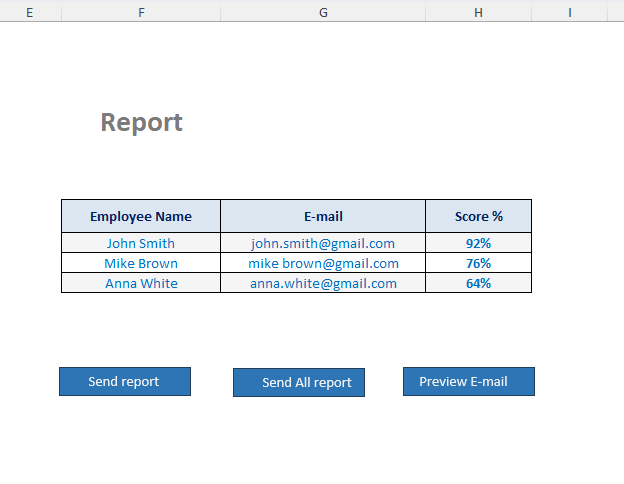
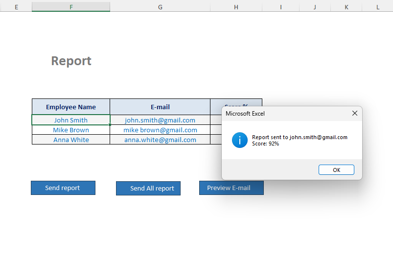
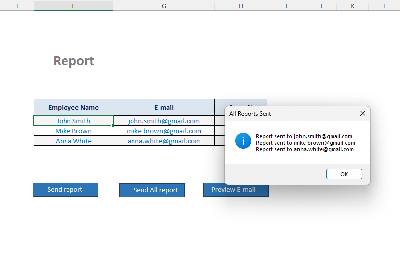
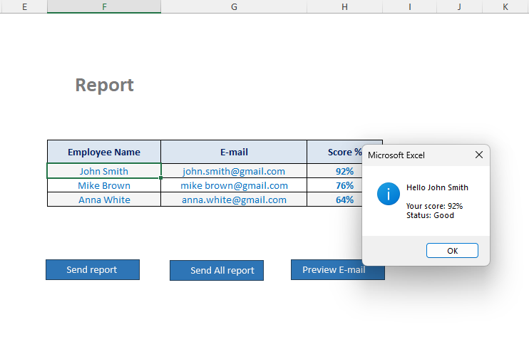

## A simple Excel-based tool for sending email reports using VBA.

## Features

- Send individual email reports  

- Send all reports at once  

- Preview email before sending  

- Clean and user-friendly interface  

---

## Interface

---

## Send Single Report

---

## Send All Reports

---

## Preview Email

---

## How it works

1. Enter employee data (Name, Email, Score)  

2. Use buttons:  

  - Send report  

  - Send all reports  

  - Preview email  

3. Emails are sent via Outlook  

---

## Technologies

- Microsoft Excel  

- VBA (Visual Basic for Applications)  

- Outlook Automation  

---

## Notes

- Microsoft Outlook must be installed  

- Enable macros in Excel  

---

## Project Structure

excel-email-automation-vba/

screenshots/

1.png  

2.png  

3.png  

4.png  

email_automation_demo.xlsm  

README.md  

---

## Author

Sergejs 

